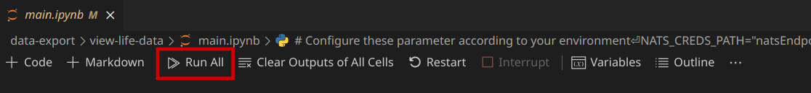
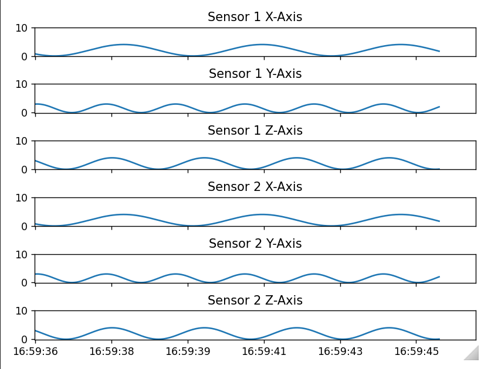

# data-export

This example shows how to export data from edgefarm.network to an external system.

The edge application `publish-export-data` generates random data and publishes it into edgefarm.network data export.

The deployment manifest `manifest.yaml` defines an `application-network`, which is required for data transportation and data export. The producing `edge-worker` needs to be a `participant` of this network. This is defined in the trait `edge-network-participant`.

The separate application `receive-historic-data`, which could run anywhere but requires a internet connection, receives the puffered data and stores it into a local `csv` file.

The Jupyter Notebook `view-life-data`, can be used to receive live data from data endpoint and view it in graphs.

## Usage

**Deploy edge application:**

`manifest.yaml` is the deployment manifest of this example. This contains a reference to the docker image of example application `publish-export-data`. Modify the docker image's tag for the correct version of the application image.

You can either build your own docker image if you like to modify the demos. For this see the [building section](../README.md#building-yourself) of this Readme.

Apply the application using kubectl.

```bash
$ kubectl apply -f data-export/manifest.yaml
namespace/data-export created
application.core.oam.dev/data-export created
```

**Check the status of the edge application:**

Check if the application is running.

```bash
$ kubectl get pods -n data-export -o wide
NAME                        READY   STATUS    RESTARTS   AGE    IP           NODE        NOMINATED NODE   READINESS GATES
publish-export-data-bjsrk   3/3     Running   0          3m4s   172.17.0.2   rpi-snake   <none>           <none>
```

View the logs of the application. Viewing can be terminated with `Ctrl+C`.

```bash
$ kubectl logs publish-export-data-bjsrk -n data-export -f
2022-04-08 12:58:01 root         INFO     Connecting to NATS server: nats://nats.nats:4222
2022-04-08 12:58:16 root         INFO     Published 1000 messages in 15 seconds. Total size: 257750. Byte per Second:  17183.
2022-04-08 12:58:22 root         INFO     Published 1000 messages in 16 seconds. Total size: 257722. Byte per Second:  16107.
...
```

**Receive the export data:**

Pass the credfile path to the app.
```bash
$ export NATS_CREDS_PATH=/path/to/credsfile/natsEndpoint.creds
```

Execute `receive-historic-data` application to collect histroic data from data endpoint and store data in local file `data.csv`.
```bash
$ python data-export/receive-historic-data/main.py
2022-04-25 16:23:13 root         INFO     Connecting to NATS server: tls://connect.ngs.global:4222
2022-04-25 16:23:48 root         INFO     Received all historic data. Proceed with live data.
```

The output csv file can be configured by executing the following just before executing the application. The file does not have to exist, but the path does.
```bash
$ export CSV_FILE=/path/to/csv-file.csv
```

**View live data**

The view life data example is realized with a Jupyter Notebook. These files can be viewed and executed e.g. with VS Code by installing the extension (Jupyter)[https://marketplace.visualstudio.com/items?itemName=ms-toolsai.jupyter].

Configure the credsfile path `NATS_CREDS_PATH` in Jupyer file `data-export/view-life-data/main.ipynb` or place the cresdsfile named as `natsEndpoint.creds` in directory `data-export/view-life-data/`.

To run Jupyter Notebook open the file `data-export/view-life-data/main.ipynb` e.g. in VS Code and click on `Run All`:



Scroll down to the bottom of the file to view the graph.


